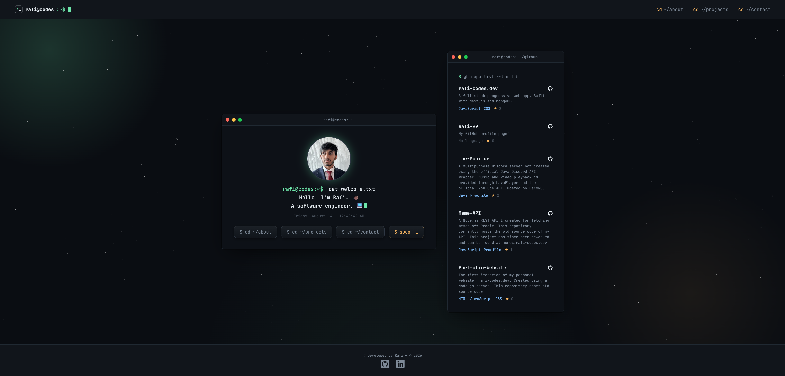

# Rafi Codes
Welcome to my personal portfolio! This website serves as a showcase for my projects and a way to contact me.

[Click here to check it out live!](https://rafi-codes.dev)



## Tech Stack
- **Next.js 16** — React framework (App Router, Turbopack).
- **React 19** — Latest version of React. Comes with performance optimizations.
- **MongoDB** — Data storage for skills & work experience.
- **Three.js / React Three Fiber** — 3D ambient background.
- **Framer Motion** — Page transitions and loading animations.
- **Googleapis & Nodemailer** — Gmail OAuth2 email delivery through the contact form.
- **Serwist** — PWA support.
- **Vercel Analytics & Speed Insights** — Performance monitoring.

## Pages
| Route       | Description                                                       |
| ----------- | ----------------------------------------------------------------- |
| `/`         | Home — Terminal-style welcome with typing effect & live clock.    |
| `/about`    | Résumé — Skills and work experience are fetched from MongoDB.     |
| `/projects` | Project - Showcase of all projects.                               |
| `/contact`  | Contact - Form with Gmail delivery and reCAPTCHA spam protection  |

## Core Project Structure
```
src/
├── app/            # App Router pages & API routes.
│   ├── about/      # Résumé page.
│   ├── contact/    # Contact page.
│   ├── projects/   # Projects page.
│   ├── api/contact # Endpoint for contact form.
│   └── layout.js   # Root layout.
├── components/     # Reusable UI components.
├── hooks/          # Custom React hooks.
├── styles/         # CSS modules (global, component, page).
└── utils/          # Utilities (e.g. DatabaseService).
```

## Features
- 🖥️ **Interactive Terminal** — A real shell on the home page, not just a div: routes the site via `cd`, keeps command history (↑/↓), autocompletes, and has Easter eggs for the curious.
- 🐙 **GitHub Widget** — Live stats for the most recent repositories, with each repository's languages broken down and ranked by actual usage percentage.
- 📊 **Live Résumé Data** — Skills and work experience are fetched live from MongoDB and rendered as real syntax-highlighted `skills.json` and job description cards.
- 💬 **Contact Form** — Sends email via Gmail OAuth2 + Nodemailer, protected by reCAPTCHA Enterprise. Monitored with a scheduled cron health check.
- 🎨 **3D Ambient Background** — A slow-drifting starfield built with React Three Fiber, layered under every page and tuned to respect `prefers-reduced-motion`.
- 📐 **Fluid, Container-Query-Driven Design** — No hardcoded breakpoints: implemented a mobile-first approach that reacts to the container's real width, not the viewport.
- 🖼️ **Dynamic Open Graph Images** — Social preview cards are generated on the fly per page via `next/og`, not static screenshots.
- 📱 **Installable PWA** — Full offline fallback and custom app icons. Installable on any device. Allows users to experience the website as an app.
- 🔍 **Complete SEO** — Sitemap, robots, manifest, and per-page Open Graph/Twitter metadata. All generated through Next's Metadata API.

## Coming Soon
- Stay tuned for more features! This README will be updated with every new feature release.

---
© Rafi Codes. All rights reserved.
